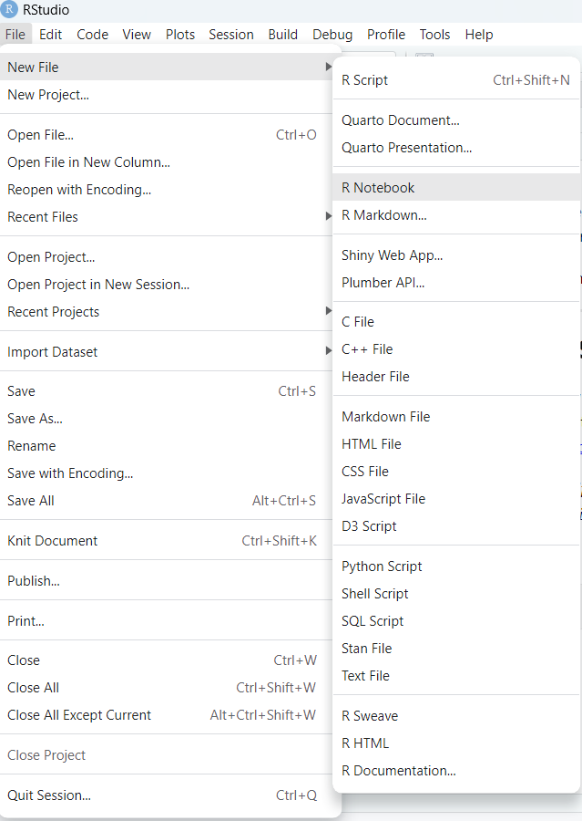
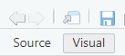
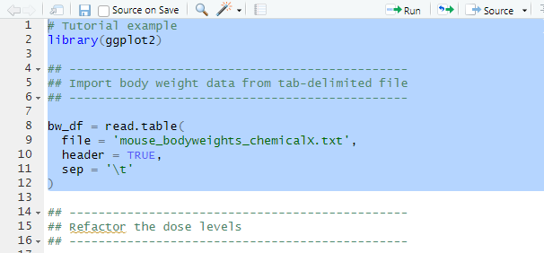
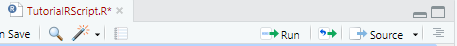
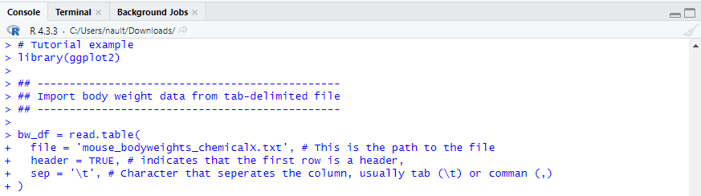

# Introduction to R Programming

R in commonly used in bioinformatics because of statistical computing capabilities and an extensive collection of packages developed by a large community of scientists.

This notebook will walk you through some of the basics of R programming to help you get started.

------------------------------------------------------------------------

## 1. Installation of R and R Studio

Before diving into R programming you will want to have both R and RStudio (interactive development environment) installed. You can download them from the official website <https://posit.co/download/rstudio-desktop/>.

> *Note: When installing R, it's wise to verify the version you choose, especially if you intend to utilize community-developed packages. For this introduction we will be using version 4.2.0.*

After opening R Studio you will want to create a new notebook and allow R Studio to install the packages needed. We will review the installation of packages later in this tutorial.

{style="border:1px solid #000000; padding:3px; margin:2px" width="484"}

### 1.1. Setting things up for this tutorial

For a more friendly format, as you walk through this notebook you can choose the visual mode.

{style="border:1px solid #000000; padding:3px; margin:2px" width="228" height="93"}

You will also want to set this downloaded folder as your *working directory*. Click on **Session** in the top menu, choose **Set Working Directory**, choose **To Source File Location**.

## 2. Let's start with some simple code!

### 2.1. Math and calculations

A common task is to perform simple and/or complex calculations. Let's estimate how many time a heart beats over a single day.

-   The average heart rate is between 60 and 100 beats per minutes. Let's use 80.

-   There are 1440 minutes in a day.

Try it below! Replace the `bpm` and `min` values in the block below then click the green run arrow

```{r}
bpm * min
```

::: {style="color: #333; border: 1px solid #190dff; border-radius: 3px;"}
**Answer:** Did you get 115200?
:::

### 2.2. Assigning variables

Next we will [assign variables]{.underline}. In programming, this means storing a value or data in a named storage location so that it can later be used within the program.

Run the following piece of code and notice how it knows the value of `bpm` and `min` for the calculation because we assigned it at the start of the code.

```{r}
bpm = 80
min = 1440

bpm * min
```

Try changing the value of `bpm` and running the code again to see what happens.

We can also assign the results so that it can later be accessed. For example:

```{r}
bpm = 80
min = 1440

total_beats = bpm * min
```

Nothing came out! Don't worry, it is just saved to the variable named `total_beats`. Lets print it to reveal the answer:

```{r}
print(total_beats)
```

### 2.3. Data types

There are 9 major type of data types in R:

-   **Numeric:** integers and floating-point numbers.

```{r}
x = 3     # numeric or integer
y = 3.14  # floating-point number

class(y)
```

-   **Integer:** numbers without any fractional parts.

```{r}
age = 25            # numeric or integer
population = 1000L  # 'L' suffix indicates an integer

class(population)
```

-   **Character:** textual data contained within single or double quotes.

```{r}
name = 'toxicology'
city = 'East Lansing'

class(city)
```

-   **Logical:** TRUE or FALSE.

```{r}
is_student = TRUE
had_lunch = FALSE

class(had_lunch)
```

-   **Factor:** Categorical data.

```{r}
treatment = factor(c("Chemical X", "Chemical Y"))

class(treatment)
```

-   **Vector:** A collection of data of the same type.

```{r}
doses = c(0, 0.01, 0.03, 0.1, 0.3, 1, 3, 10, 30)    # numeric vector
treatments = c('control', 'low dose', 'middle dose', 'high dose') # treatments

class(treatments)
```

-   **Matrix:** Two-dimensional array with rows and columns containing elements of the same type.

```{r}
mat = matrix(1:9, nrow = 3, ncol = 3)

print(mat)
```

-   **Data Frame:** Two-dimensional tabular data which allows different data types in the columns.

```{r}
df = data.frame(
  ID = c('M01', 'M02', 'M03'),
  weight = c(23.4, 21.2, 20.9),
  treatment = c(FALSE, TRUE, TRUE)
  )

print(df)
```

-   **List:** A collection of objects (can be different data types) arranged in a specific order.

```{r}
my_list = list(
  control = c("M01", "M03", "M05"),
  treated = c("M02", "M04", "M06")
)

print(my_list)
```

When working with R, you'll encounter a variety of basic data types that form the building blocks of your analysis. However, there are also more complex types, like S4 vectors, which you might encounter when dealing with specialized data, such as single-cell data. But let's focus on the basics for now. One interesting aspect of R is how it handles different data types when you mix them together.

To explore this, let's play around with data types. We can mix numeric, character, logical, and other types to see how R handles them. One handy function to determine the data type of an object is **`class()`**. It tells you which data type R considers the object to be.

```{r}
# Test out your code here! Don't worry about causing errors.

incompatible = c(1L, 5.4, FALSE, 'Broken')

print(incompatible)
print(class(incompatible))
```

[*Notice how combining types of data defaults to character. R no longer recognizes the integers, numbers, or logicals. This is a common cause for errors to be aware of.*]{.underline}

------------------------------------------------------------------------

## 3. Installing and loading packages

R's extensive collection of packages, particularly those tailored for bioinformatics, is one of the main reasons it's widely used in research and data analysis. There are three primary mechanisms for installing R packages: The Comprehensive R Archive Network (CRAN) repository, Bioconductor, and developer tools. However, for simplicity in this tutorial, we'll focus on CRAN and Bioconductor, leaving out developer tools as they can introduce complexities, such as package conflicts.

### 3.1. Using CRAN repository

Packages from the CRAN repository can be installed using the simple command `install.packages("package_name")`. Let's install the popular plotting package ggplot2 as an example:

```{r}
install.packages("ggplot2")
```

Watch for messages which indicate either successful or failed installation.

### 3.2. Using Bioconductor

Bioconductor maintains packages for bioinformatics and genomics analyses. To install these package, you first need to install BiocManager:

```{r}
if (!requireNamespace("BiocManager", quietly = TRUE))
    install.packages("BiocManager")
BiocManager::install()
```

This looks more complicated, but all we added here was an `if statement` to check whether BiocManager was already loaded.

Now lets install the GenomicRanges packages using Bioconductor:

```{r}
BiocManager::install("GenomicRanges")
```

### 3.3. Loading the libraries

Now that we've installed the packages, how to we tell R to load them so that they can be used? We use the `library` command. Here we will load both newly installed packages:

```{r}
library(ggplot2)
library(GenomicRanges)
```

### 3.4. Installing the required packages for this workshop

This workshop which will eventually explore and analysis single-cell transcriptomic data will depend on several specialized packages. Before we start, lets install them all:

```{r}
install.packages(c('tidyr','dplyr', 'deSolve', 'ggplot2', 'here', 'SoupX', 'remotes'))

if (!requireNamespace("BiocManager", quietly = TRUE))
    install.packages("BiocManager")

BiocManager::install(c('Seurat', 'pheatmap', 'SingleCellExperiment', 'scDblFinder'))
```

*Note, you might run into some installation problems for Seurat/SeuratObjects. As packages get more complex and depend on other packages, there are sometimes conflicts when updates occur. Here Matrix may be posing a problem. To fix this, install Rtools42 and use the following command: `remotes::install_version("Matrix", version = "1.6.5")`*

```{r}
suppressPackageStartupMessages({
  library(tidyr)
  library(dplyr)
  library(deSolve)
  library(ggplot2)
  library(Seurat)
  library(pheatmap)
  library(here)
  library(SoupX)
  library(SingleCellExperiment)
  library(scDblFinder)
})
```

***Note:*** Notice how we leverage a `character vector` object to install multiple packages at once. The same result could have been accomplished by installing one package at a time as in the previous examples. This is one trick that can minimize the amount of time spent writing lines.

**Now we're ready to go!**

------------------------------------------------------------------------

## 4. Data Import

In real-world applications, typing in data manually, as we did in our previous examples, is not a common practice. While it's great for illustrating concepts or setting constants like fold-change thresholds (e.g., **`FC_threshold = 1.5`**), handling large datasets typically requires different approaches for importing data into R. Instead of manual entry, we typically rely on various mechanisms to import data into R.

### 4.1. External tables

::: {style="color: #333; border: 2px solid #ff9900; border-radius: 5px;"}
**Tip:** Whenever you're unsure how to use a command in R, simply type `?command_name` in the command line (usually at the bottom of the screen). For example, `?read.table` will show you what inputs are needed, as well as some examples. ***Give it a try in the console below!***
:::

We are probably all familiar with data tables. This is one of the most common formats because it is an effective way to store, view, and work with data. This section will focus on how to we work with tables that were saved and/or created by other programs. However, as you start thinking about your own data and how to organize it, you are strongly encouraged to explore the section of **data formatting** where we discuss the advantages and disadvantages of using *wide* vs *long* tables and other aspects of formatting.

[*Before we start: Download this folder and save it in the same folder that this tutorial is in.*]{.underline}

#### 4.1a. Tab-delimited tables

Let's pretend that we have a [*tab-delimited table*]{.underline} of body weights with 2 columns: treatment group and weight (in grams). We want to import that table in order to be able to visualize it. First we want to `read.table` as shown here:

```{r}
bw_df = read.table(
  file = './datasets/mouse_bodyweights_chemicalX.txt', # Path to the file
  header = TRUE, # indicates that the first row is a header,
  sep = '\t', # Character that seperates the column, usually tab "\t" or comma ","
)
```

***Note:*** we use the `#` symbol to make comments. The text following the character is ignored by the code interpreter allowing someone to add information in plain language to guide other users, or even themselves at a later date.

Now lets look at the table we just imported.

```{r}
print(bw_df)
```

Even more exciting, now that we've imported data we can visualize it! Lets try a simple boxplot:

```{r}
# Create a boxplot using ggplot2
ggplot(bw_df, aes(x = Group, y = Value, fill = Group)) +
  geom_boxplot() +
  labs(title = "Boxplot Example", 
       x = "Group", 
       y = "Value") +
  theme_bw()
```

#### 4.1b. Excel tables

As you become more comfortable with coding for your data analysis you will see that it is generally easier to work with *tab-delimited (.txt, .tab) or comma-separated (.csv)* files. However, it is not impossible or that much harder to work with excel tables if it is what you have (though you can always export the table). Excel is a proprietary format and the possibility of having multiple sheets in a file is where some of the challenges arise. To deal with this we need to use a package such as `readxl`. Use the following empty code chunks and lessons from section 3 to install and load this package

```{r}
# Write your code to install readxl from CRAN and try it out

```

::: {style="color: #333; border: 1px solid #190dff; border-radius: 3px;"}
**Answer:** install.packages('readxl')
:::

```{r}
# Load the readxl package

```

::: {style="color: #333; border: 1px solid #190dff; border-radius: 3px;"}
**Answer:** library(readxl)
:::

```{r}
df = read_excel('./datasets/mouse_bodyweights_chemicalX.xlsx', # Path to the excel file 
                sheet = "body_weights_cohort1", # Name of the sheet with your data 
                skip = 0 # The header is in the first row
                )

print(head(df))
```

```{r}
# Create the same boxplot using ggplot2
ggplot(df, aes(x = Group, y = Value, fill = Group)) + # We replaced df
  geom_boxplot() +
  labs(title = "Boxplot Example", 
       x = "Group", 
       y = "Value") +
  theme_bw()
```

### 4.2. R objects

For more complex objects, such as single-cell and spatial transcriptomic data, researchers will simply save their R object as it is using commands such as `save` or `saveRDS`. We will discuss how to save these objects in a later section. The advantage of doing this is that is maintains all of the information and formatting that the data generator will have added which does not effectively transfer to a table. For example; *Did the analysis use dose as a number or a factor? Was the data stored as a matrix, dataframe, or vector?* Providing the R object can help improve the reproducibility of analyses in certain scenarios.

Here we will focus on R objects which represent single-cell RNA sequencing datasets. These datasets typically are stored using a complex format such as `S4 vector` which, in a very simplified description, allows the use of `slots` to hold metadata, raw counts, normalized counts, gene details, dimensionality reductions, and more...

***Downloading data from public repositories***

In a later section we will discuss data management, sharing, and repositories. For now we will just explore R functions using some sample data. Let's get existing processed data from the *Satija lab (NYU Genome Center)* available [here](https://satijalab.org/seurat/archive/v3.2/de_vignette). We can download the data directly through the web browser.

We are using this dataset because it is small. Many groups share they're complete datasets, which can range from 500MB - 100GB, or more, at the [Gene Expression Omnibus](https://www.ncbi.nlm.nih.gov/geo), [Broad Single Cell Portal](https://singlecell.broadinstitute.org/single_cell), and other local servers.

***First,*** we need to load the libraries which were used to create the object for it to load correctly. If these are not loaded you will receive an error message which tells you which library you need

```{r}
library(Seurat)
```

Now lets import the object.

```{r}
seurat_object <- readRDS('./downloads/pbmc3k_final.rds') 

# It will give you an error message, this is OK, we fix it here
seurat_object <- UpdateSeuratObject(seurat_object)
```

And lets `print` the object just to see if it loaded correctly

```{r}
print(seurat_object)
```

Hopefully it looks like it ran successfully for you. You should see...

```         
An object of class Seurat  
13714 features across 2638 samples within 1 assay  
Active assay: RNA (13714 features, 2000 variable features)  
  3 layers present: counts, data, scale.data  
  2 dimensional reductions calculated: pca, umap
```

Just for fun! Lets look at how having the complete R object can be really helpful. We can generate the following plot with no need to reprocess the data!

```{r}
DimPlot(seurat_object, label = TRUE, label.size = 5) + NoLegend()
```

------------------------------------------------------------------------

## 5. Exploring your data

In this section we will get a birds eye view of ways that you can explore your imported data. This is in no way comprehensive, but is intended to give you some ideas as to how you can better understand your R objects, extract certain pieces of information, or even troubleshoot issues along the way. Let's start with the body weight figure generated from `bw_df`.

### 5.1 Example 1 - Redefining factors

In [**section 4.1a**]{.underline} we plotted body weight data, but you probably noticed that the order of the columns was not as expected. The high dose appeared before the low dose because the groups were sorted in alphabetical order. So how can we fix this?

Here we will use the [*subsetting operator*]{.underline} `$` to get more information

```{r}

# 1. Identify what type of data is in the Group column
group_class = class(bw_df$Group)
print(group_class)

#2. Return the levels and their order 
group_levels = levels(bw_df$Group)
print(group_levels)
```

We see that this column is not in fact a `factor`, but just `characters`. Therefore, R does not now what its levels are. We can set them:

```{r}

# 1. Define the order of the levels we want
group_order = c('Control', 'Low Dose', 'Medium Dose', 'High Dose')

# 2. Create a vector from the Group column where the levels are defined 
group_levels = factor(bw_df$Group, # Get the data from the Group column
                      levels = group_order # Define the order of the groups
                        ) 

# 3. Replace the group column with the new vector defining the factor levels
bw_df$Group = group_levels

# 4. Replot the data
ggplot(bw_df, aes(x = Group, y = Value, fill = Group)) +
  geom_boxplot() +
  labs(title = "Boxplot Example", 
       x = "Group", 
       y = "Value") +
  theme_bw()
```

Now your plot should be in the correct order as you defined it.

**Key takeaways:**

-   You can access information in a specific column using the `$` operator

-   Use commands such as `class` and `print` to get more details about your object

-   A common *issue* is that data is not recognized as the type you expect it. This can be easily fixed.

### 5.2. Example 2 - Slots and columns

As we discussed, S4 objects are more complex because of they use of slots. However, these can be accessed almost as easily as columns. Often times, the biggest challenge is knowing what slots and columns are available.

::: {style="color: #333; border: 2px solid #ff9900; border-radius: 5px;"}
**Tip:** Use the Tab key!! Most code development environments have adopted the concept that using the Tab key will *autocomplete* your commands. When you start typing your command try hitting the Tab key and look at what options are presented. For example, try the following in the console:

read.tab **–\>Tab\<--**

bw_df\$ **–\>Tab\<--**
:::

Lets explore the Seurat object to see how we can access key pieces of information.

***Listing slot names***

```{r}
slot_names = slotNames(seurat_object)
print(slot_names)
```

Equivalently, you can sometimes use the `@` operator followed by **–\>Tab\<--**

***Exploring the metadata slot***

```{r}
metadata = seurat_object@meta.data
print(metadata[1:5,1:5]) # This table is very big, [1:5,1:5] prints the first 5 columns and rows.
```

Given how big this table is, how can we find out what columns are available for us to visualize or explore? We can use the `colnames` command on that slot.

```{r}
metadata_columns = colnames(metadata)
print(metadata_columns)
```

Great! So now we know what columns are available. This can help us with downstream steps such as the visualization here where we label based on the Leiden cluster instead of the cell type.

```{r}
DimPlot(seurat_object, group.by='RNA_snn_res.0.5', label = TRUE, label.size = 5) + NoLegend()
```

------------------------------------------------------------------------

## 6. Running R scripts

So far we've run pieces of code in `chunks` in this `R markdown notebook`. This can be convenient because it allows the mixing of normal text and code in a very descriptive manner. In the course of this workshop we will be doing computational modeling using a series of pre-generated `Rscript` files.

#### (1) Open the .R file in RStudio

As an example we will use the file called ***Plot_bodyweights_example.R***

#### (2) Highlight a section of code

{style="border:1px solid #000000; padding:3px; margin:2px"}

This allows you to decide exactly which lines of code you want to run.

#### (3) Select "Run"

{style="border:1px solid #000000; padding:3px; margin:2px"}

You can also use Ctrl + Enter (PC) or Command + Return (Mac)

#### (4) Examine output in console and in your folders

{style="border:1px solid #000000; padding:3px; margin:2px"}

After you've run the complete tutorial R script you should have a new file in your folder called .png (you may have to double click on the image below to refresh it):

{style="border:1px solid #000000; padding:3px; margin:2px" width="372"}

------------------------------------------------------------------------

## Additional Resources

-   [An introduction to R from the R core team](chrome-extension://efaidnbmnnnibpcajpcglclefindmkaj/https://cran.r-project.org/doc/manuals/R-intro.pdf)

-   [W3Schools R introduction](https://www.w3schools.com/r/r_intro.asp)

-   Check out [MSU HPCC OnDemand](icer.msu.edu) and [iCER workshops and events](https://icer.msu.edu/upcoming-workshops) for MSU-based R resources
