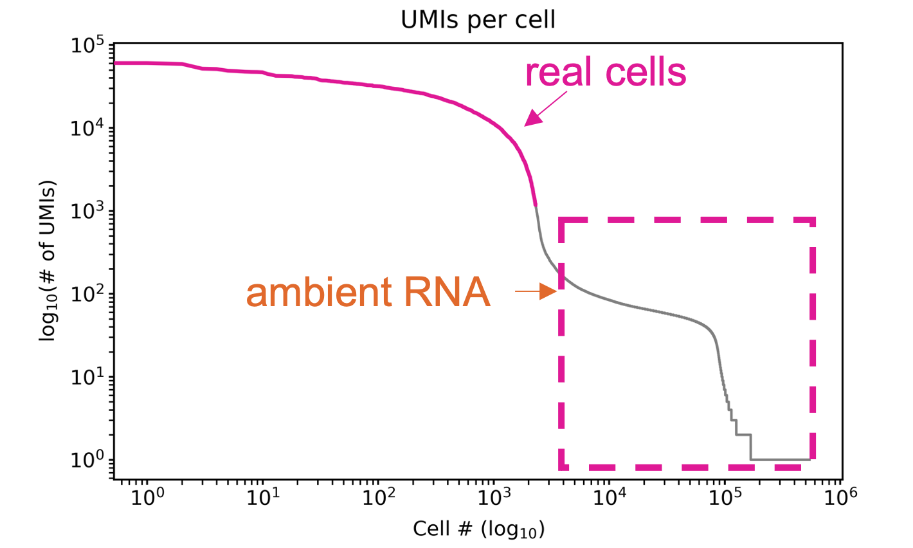
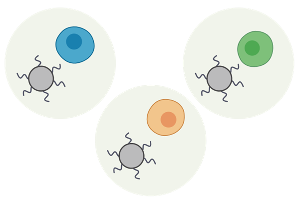
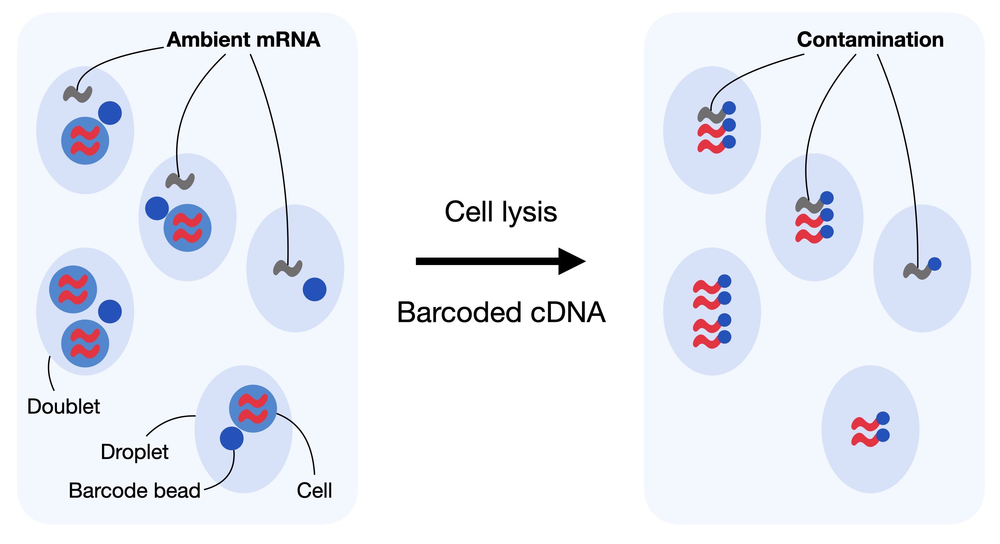
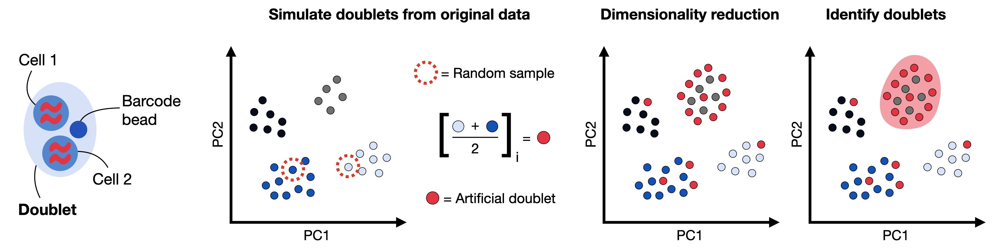

# Introduction to scRNAseq and data pre-processing

------------------------------------------------------------------------

## 1. FASTQ Files, genome alignments, and deconvolution of cells

This module of the CSTMI workshop provides an overview of key quality control (QC) metrics and pre-processing steps in the initial analysis of single-cell transcriptomic data [beginning after alignment to a reference genome]{.underline}. Detailed tutorials for processing raw BCL and FASTQ files, performing genome alignments, and deconvoluting cells from empty GEMs/wells are available through various resources, we will focus on understanding what is captured and represented in single-cell data.

*See below for links to alignment and preliminary analysis tutorials:*

::: {style="border: 2px solid forestgreen; background-color"}
-   Vendor-specific pipeline resources (e.g., [10X Genomics](https://www.10xgenomics.com/support/software/cell-ranger/latest/tutorials/cr-tutorial-in))

-   [Galaxy](https://training.galaxyproject.org/training-material/topics/single-cell/tutorials/scrna-preprocessing/tutorial.html)

-   Google colab hands-on experience ([*under constructio*n]{.underline})
:::

Most of these `pipelines` will provide a summary report such as this [10X Genomics report](https://cf.10xgenomics.com/samples/cell-exp/7.0.1/SC3pv3_GEX_Human_PBMC/SC3pv3_GEX_Human_PBMC_web_summary.html) or this one from [Parse Biosciences](https://cdn.parsebiosciences.com/pbmc/v2-vs-v3/v3-all-sample_analysis_summary.html). These reports provide the most basic information to assess the quality of the data starting with the [*knee plot*]{.underline}.

### 1.1. Understanding the 'knee plot'

Upon receiving aligned single-cell/nuclei sequencing data, one of the initial plots to examine is the 'knee plot,' commonly generated during analysis pipelines. This plot helps distinguish between barcodes representing cells and those representing background noise or empty Gel Emulsion beads (GEMs).

*Gel Emulsion beads (GEMs)* are microfluidic droplets used in platforms like 10X Genomics, each potentially containing a cell or nuclei. Distinguishing between GEMs with cells and empty GEMs is crucial for accurate analysis.

The knee plot visually depicts how a threshold is set to differentiate between cell barcodes and background noise. In platforms like 10X Genomics, cells within GEMs produce a larger number of unique mRNA molecules (UMIs) compared to empty GEMs. The knee plot typically shows a sudden drop (knee) in UMIs, indicating the separation between GEMs containing cells and those lacking them.

[{style="border:1px solid #000000; padding:3px; margin:2px" width="564"}](https://link.springer.com/protocol/10.1007/978-1-0716-2756-3_1)

Interpreting the knee plot involves identifying this knee point. A distinct knee suggests successful separation, while the absence of a clear knee could indicate issues such as low RNA integrity or high ambient RNA contamination.

[{style="border:1px solid #000000; padding:3px; margin:2px" width="553"}](https://isoseq.how/umi/cell-calling.html)

Now that we have a general idea of what to look for in a summary report, lets use real data to start exploring more advanced QC metrics which require additional analysis steps.

------------------------------------------------------------------------

## 2. Setting up our R environment for data exploration

In preparation for the following hands-on experiences we will set up an R environment which has everything we need.

### **2.1. Load libraries**

```{r}
suppressPackageStartupMessages({
  library(Seurat)
  library(ggplot2)
  library(tidyr)
  library(scDblFinder)
  library(SingleCellExperiment)
})
```

### **2.2. Import data**

For this tutorial we will use raw unprocessed data from human peripheral blood mononuclear cells (PBMCs) generated using the 10X Genomics platform which can be download from the [Seurat page](https://satijalab.org/seurat/articles/pbmc3k_tutorial). These data should be downloaded, extracted, and placed in the downloads folder for this workshop.

```{r}
# Load the PBMC dataset
pbmc.data <- Read10X(data.dir = "./downloads/filtered_gene_bc_matrices/hg19/")
# Initialize the Seurat object with the raw (non-normalized data).
seurat_object <- CreateSeuratObject(counts = pbmc.data, project = "pbmc3k", 
                                    min.cells = 3, min.features = 200)
```

*Note: We apply some preliminary filters as we know that GEMs which very low numbers of genes or genes which are barely detected are unlikely to be actual cells.*

### **2.3. Check that everything was loaded correctly**

```{r}
print(seurat_object)
```

## 3. Overview of Single-cell Data Structure

To better understand how to work with single-cell/nuclei RNA sequencing data we will take a deep dive into how datasets are *typically* structured. In the diagram below we illustrate how droplet-based scRNAseq approaches separate cells and their mRNAs. But how does this translate into [***data***]{.underline}?

{style="border:1px solid #000000; padding:3px; margin:2px" width="469"}

### 3.1. The Gene x Cell Matrix

```{r}
# Raw counts in a seurat object is saved in the assays-RNA-counts slot 
raw_counts = as.matrix(seurat_object@assays$RNA@layers$counts)
rownames(raw_counts) = rownames(seurat_object)
colnames(raw_counts) = colnames(seurat_object)

# Lets look at the first 4 columns and rows
print(raw_counts[1:4,1:4])
```

***What does this mean?***

**Columns:** The columns represent a unique `barcode`. As we can see below, this `barcode` marks an individual cell which is how we can identify each one. So in this object, the columns are the cells

{style="border:1px solid #000000; padding:3px; margin:2px" width="834"}

**Rows:** We see that the first few rows have names such as *RP11-206L10.9.* A quick *google* search will tell you that this is a human gene (Ensembl ID - ENSG00000237491). So we see in this object that the rows represent the genes.

### 3.2. Counting the number of cells and genes

Single-cell transcriptomic analysis tools (*e.g.*, Seurat) does a lot of the heavy lifting for us when it comes to counts and other summary data information. For example, the following code will tell you the number of genes and cells, as well store raw, normalized, and scaled data, dimension reductions, and other analyses which may have been performed.

```{r}
print(seurat_object)
```

This indicates that we have 13,714 genes (features) across 2,700 samples.

However, we can also extract that information from the count table:

```{r}
print(paste0('Cells: ', ncol(raw_counts)))
print(paste0('Features:', nrow(raw_counts)))
```

These numbers should match!

### 3.3. A deeper dive into counts

#### 3.3a. What is sequencing depth?

```{r}
# Calculate the total reads in each individual cell
read_depths = colSums(raw_counts)

# How are they distributed?
hist(read_depths, main = "Histogram of read depth", 
     xlab = "Depth", ylab = "Frequency",
     breaks = 200)
```

This histogram shows that the number of mRNA transcripts detected in each cell ranged from 546 to 15,818, but that most were around 2,000. So what might account for these differences?

-   **Cell types:** Some cell types may simply just express more mRNA than others. For example, Hepatocytes are known to contain a lot of RNA while others may not.

-   **Stochastic gene expression:** Fluctuations in transcription and degradation from normal biological processes, cell states, and other factors in individual cells which have very low amounts of RNA to begin can appear as big differences.

-   **Technical variability:** Sequencing depth, assay kits, and other technical factors may contribute to these differences.

[*The zero-inflation debate*]{.underline}*: In the early days of scRNAseq it was a widely accepted that data was zero-inflated, i.e., it had more zero's than it should because of technical challenges. Today, we better understand that the large number of zero's are not only technical, but in fact does reflect true biology as well. The following manuscript delves deeper into the debate: [Jiang et al., 2022](https://genomebiology.biomedcentral.com/articles/10.1186/s13059-022-02601-5)*

#### 3.3b. Another way to look at depth

Sequencing depth ultimately drives the ability to detect individual genes in a cell or sample (bulk RNA seq). As more reads are performed on a sample, the probability of capturing a lower abundance gene increases. Therefore, sequencing depth can have a significant impact on the end results of your sequencing results.

*So why not sequence as deep as possibe?* As with anything, we need to balance cost with value. The following figures are standard outputs from scRNAseq reports including those linked above.

.png){style="border:1px solid #000000; padding:3px; margin:2px" width="708"}

As you can see, the more reads we have per cell, the smaller the slop for capturing new genes gets. Therefore, the difference between capturing 80% of genes and 100% could mean 2, 10, or even \>100X the amount of sequencing. Is it truly worth it for capturing a gene who expression is so low? This is why we limit our depth for sequencing and why most datasets produced with the sample platform will tend to detect a similar number of genes.

### 3.4. Common Storage Formats

#### 3.4a. Sparse tables (raw)

We previously mentioned that single-cell/nuclei transcriptomic data has a lot of zeros. Lets actually look at the count distribution so you can see:

```{r}
# We wan to collapse all the values into a vector of values
mat_values <- as.vector(raw_counts)

# Plot histogram
hist(mat_values, main = "Histogram of Matrix Values", xlab = "Value", ylab = "Frequency", breaks = 600, xlim = c(0,10))
```

This is why you will almost always find raw scRNAseq data saved as a `.mtx` (sparse matrix) file or format.

Here we will download publicly accessible sparse matrices from the [Gene Expression Omnibus](https://www.ncbi.nlm.nih.gov/geo), an excellent resource for obtaining raw data if you want to reuse and reanalyze existing data. This dataset is from [single-nuclei RNA sequencing of livers from mice treated with the environmental contaminant 2,3,7,8-tetrachlorodibenzo-*p*-dioxin (TCDD)](https://www.ncbi.nlm.nih.gov/geo/query/acc.cgi?acc=GSE184506).

```{r}
#download.file('https://www.ncbi.nlm.nih.gov/geo/download/?acc=GSE184506&format=file&file=GSE184506%5Fsct%2Emtx%2Egz', './downloads/matrix.mtx.gz')
system("gunzip ./downloads/matrix.mtx.gz")

#download.file('https://www.ncbi.nlm.nih.gov/geo/download/?acc=GSE184506&format=file&file=GSE184506%5Fsct%2Ebarcodes%2Etsv%2Egz', './downloads/barcodes.tsv.gz')
system("gunzip ./downloads/barcodes.tsv.gz")

#download.file('https://www.ncbi.nlm.nih.gov/geo/download/?acc=GSE184506&format=file&file=GSE184506%5Fsct%2Egenes%2Etsv%2Egz', './downloads/genes.tsv.gz')
system("gunzip ./downloads/genes.tsv.gz")
```

```{r}
# Read the first few lines of the file
lines <- readLines('./downloads/matrix.mtx', n = 10)

# Print the lines
cat(lines, sep = "\n")
```

As you can see, there is not a zero in sight here. After you read the first 2 summary lines you can see the following structure:

| Feature/Gene                                   | Barcode/Cell                                      | Count/Value                                |
|------------------------|--------------------------|----------------------|
| Refers to the row number in the genes.tsv file | Refers to the row number in the barcodes.tsv file | Include all non-zero values of the dataset |

Let's see what this is here

```{r}
# Read the specific line of the file
readLines('./downloads/genes.tsv', n = 15)[15]

# Read the specific line of the file
readLines('./downloads/barcodes.tsv', n = 1)[1]
```

From here we can see that the first row of data in the `mtx` file represent the gene ***Sntg1*** for the cell with barcode ***AAACCCACAACTTCTT_1***.

#### 3.4b. Seurat object

[{style="border:1px solid #000000; padding:3px; margin:2px" width="613"}](https://sib-swiss.github.io/single-cell-training/day1/day1-2_analysis_tools_qc.html)

Seurat objects are probably the most commonly used to store and organize scRNAseq data for R users. So far this is what we have used for the published PBMC data which we imported in *Section 2*. Let's take another closer look at this object:

```{r}
print(slotNames(seurat_object)) # Lets examine all the slots
```

There is a lot of information, but the ones you will most commonly use if you do single-cell analyses in R are `assays`, `meta.data`, and `reductions`

-   ***Assays*** will hold the count data

-   ***Meta.data*** will hold the metadata for each individual cell/nuclei

-   ***Reductions*** will hold the dimension reductions for visualizations

#### 3.4c. SingleCellExperiment

Another common format in R are SingleCellExperiments. They contain the same information, but are organized in a different manner.

[{style="border:1px solid #000000; padding:3px; margin:2px" width="618"}](https://bioconductor.org/books/3.13/OSCA.intro/the-singlecellexperiment-class.html)

First, let's convert our seurat object to SingleCellExperiment. Most formats can easily be interchanged:

```{r}
sce = as.SingleCellExperiment(seurat_object)
```

Next, lets see what the structure looks like:

```{r}
print(sce)
```

Here we can see:

-   **rownames** and rowData contain the gene information and metadata

-   **colnames** and colData contain the cell information and metadata

-   **assays** here also hold the count data

We can examine the pieces of data such as the cell metadata as follows:

```{r}
print(colData(sce))
```

#### 3.4d. AnnData/H5AD (Python)

This workshop will not go into python resources, but it is imporant to note that Python and R are the two most common programming languages for single-cell transcriptomic analysis and it is not uncommon to have to use both. The H5ad file format is similar to the Seurat object and SingleCellExperiment object in the sense that it stores the different components of the data in an organized manner.

[{style="border:1px solid #000000; padding:3px; margin:2px" width="430"}](https://www.sc-best-practices.org/introduction/analysis_tools.html)

------------------------------------------------------------------------

## 4. Assessing data quality

Any analysis, no matter of size, should undergo rigorous QC. When it comes to single-cell transcriptomic data, there are several computational tools that help you in the process from enabling visualizations to performing a panel of QC tests and reporting several different metrics for the end user to evaluate. A list of just some of these tools can be found [here](https://www.scrna-tools.org/tools?sort=name&cats=QualityControl).

Let's go through some of the most common QC metrics, what to they mean, and why do they matter?

### 4.1. Genes and transcripts

*How does the number of detected genes and transcripts indicate quality?* While we don't have a known number of expressed genes for each cell type, we do know that cells require the expression of hundreds to thousands of genes to function properly.

**Number of genes (features)**

We can check these values by running the code below:

```{r}
VlnPlot(seurat_object, features = 'nFeature_RNA') + NoLegend()
```

Here we can see that (1) the number of genes detected ranges from \~200 - 3000 and (2) most express \~900 genes. *Is this normal and expected?* In reality, there is no universal threshold, these values will depend on the cell type and the sequencing depth. But we do know that if most cells had extemely low counts that either cells were not healthy/intact or sequencing depth was much too low. It could also point to errors further upstream such as alignment to the incorrect reference genome.

**Number of mRNA molecules (count)**

We can also examine the total number of mRNA molecules detected:

```{r}
VlnPlot(seurat_object, features = 'nCount_RNA')
```

As above, we can see a good distribution centered around 2500 mRNA molecules. These value should always be higher than the number of features.

**Correlation of features and molecules**

A third way to look at this data is to examine the correlation of features and mRNA molecules:

```{r}
FeatureScatter(object = seurat_object, feature1 = 'nCount_RNA', feature2 = 'nFeature_RNA')
```

This metric is more informative because it tells you that as you detect more mRNA molecules, you also detect more different genes. This would generally be expected as you are getting a larger sampling of the mRNA resulting in an increased chance of sampling different genes. However, when you assess these plots, you will want to [**keep the biology in mind**]{.underline}.

### 4.2. Mitochondrial RNA

Here, biological knowledge is extremely important for evaluating this metric and removing cells based on a threshold. Consider these three experiments:

-   Nuclei isolated from muscle cells which require a lot of energy

-   Muscle whole cells which require a lot of energy

-   Skin cells which are less metabolically active

*What would you expect to see (qualitative) in the amount of mitochondrial genes for each of these experiments?*

**Assessing percent mitochondria counts**

We can assess the percentage of mitochondrial genes by calculating the number of counts coming from mitochondrial genes (usually prefixed with mt- or MT-) compared to the total counts. This can be visualized like this:

```{r}
# Calcuate the percentage of mitochondrial counts
seurat_object[["percent.mt"]] <- PercentageFeatureSet(seurat_object, pattern = "^MT-")

# Plot the values
VlnPlot(seurat_object, features = 'percent.mt')
```

We see that the percentage of counts representing mitochondrial genes is mostly below 5% but as high as \~25%. To evaluate these results think back to the three experiments and consider what you would expect to see:

-   Nuclei isolated from muscle cells which require a lot of energy

    Despite being metabolically active, nuclei isolation is expected to wash out mitochondria. High contamination is indicative of high ambient RNA or mitochondria sticking to the the nuclei.

-   Muscle whole cells which require a lot of energy

    Given that muscle cells are highly metabolically active and are known to have among the most mitochondria among mammalian cells, these data may show higher percentage of mitochondrial genes than most datasets.

-   Skin cells which are less metabolically active

    Given that these are less metabolically active, they may be expected to show similar or lower percentage of mitochondrial genes.

**Correlation of counts and mitochondrial counts**

As with the features and counts, we can look at how these correlate:

```{r}
FeatureScatter(seurat_object, feature1 = 'nCount_RNA', feature2 = 'percent.mt')
```

Interestingly, these are not correlated at all. Prior to filtering, these values will be anti-correlated as mitochondria often makes up the ambient RNA (release from dead or lysed cells) and will be more represented in the background (low count cells).

### 4.3. Ambient RNA contamination

As with any single-cell transcriptomic tool, there are dozens, if not more, options for removal of abient RNA. Generally, the concept for ambient RNA removal is the same - substract genes which are present in the *empty* GEMs/wells from those which are found to have cells. Other techniques such as combinatorial barcoding approaches have to make different assumptions.

{width="520"}

[SoupX](https://academic.oup.com/gigascience/article/9/12/giaa151/6049831) is one example of a tool which cleans up the *soup* (floating ambient RNA) from cells. This tools uses the most raw format of data which is generate before a threshold is set on the knee plot discussed above. For 10X Genomics these are stored in the `raw_feature_bc_matrix` and `filtered_feature_bc_matrix` folders.

This tutorial will not go through the entire ambient RNA removal workflow. Excellent examples can be found [here](https://cellgeni.github.io/notebooks/html/new-10kPBMC-SoupX.html) and [here](https://cran.r-project.org/web/packages/SoupX/vignettes/pbmcTutorial.html).

### 4.4 Doublets

Another common challenge with using single-cell transcriptomic platforms is one that can affect most single-cell based techniques including flow cytometry - doublets. These can be a result of cells sticking to each other or being too close to each other during the *sorting*, and the rate is typically a function of the total number of cells examined (more cells results in more doublets).

{width="996"}

*Note: We will discuss dimension reduction which is central to this approach in a later module.*

Doublets can consist of either 2 cells of the same type (homotypic) or different cell types (heterotypic). As you can probably imagine, distinguising homotypic doublets is more challenging, but are generally considered to be less of a concern.

[DoubletFinder](https://www.cell.com/cell-systems/fulltext/S2405-4712(19)30073-0) and [scDblFinder](https://www.cell.com/cell-systems/fulltext/S2405-4712(19)30073-0) are R based tool for the identification of doublets based on the general principle outlined above. This example uses scDblFinder:

```{r}
sce = as.SingleCellExperiment(seurat_object) # We need to convert the Seurat format to SingleCellExperiment format
sce <- scDblFinder(sce) # Run scDblFinder
```

Next we will transfer the information gained from this analysis into the Seurat object so that we can visualize it a later step.

```{r}
# Transfer the doublet information to the seurat object
seurat_object$scDblFinder.class = colData(sce)$scDblFinder.class
seurat_object$scDblFinder.score = colData(sce)$scDblFinder.score

```

### 4.5. Filtering data

Ultimately, the purpose of the QC analyses is not only to understand your data and find any major issues. It is also used to identify individual data points which are likely problematic and could negatively impact subsequent analyses. Because we often have thousands of data points, we generally accept that some of these data points are technical noise which can simply be removed. For example, here we:

-   Remove cells with extremely high or low counts as either empty droplets or multiplets.

-   Remove cells with more than 5% of reads from mitochondrial genes as an indicator of unhealthy cells.

-   Remove cells classified as doublets.

```{r}
seurat_object <- subset(seurat_object, subset = nFeature_RNA > 200 & nFeature_RNA < 2500 & percent.mt < 5 & scDblFinder.class == 'singlet')

print(seurat_object)
```

## 5. Metadata!

We’ve invested a lot of effort, time, and money in generating and processing these data. From this we get *tons* of data which can be mined across several projects, labs, and institutions… *or can we?*

It is absolutely critical to not ignore the metadata slot of whatever single-cell object your are working with, both as a data generator and as a user of the data.

```{r}
print(seurat_object@meta.data)
```

Can you see anything missing here? Consider this, could you describe the study design, model, and other important experimental details simply by looking at the information in this table?

Let's start addressing some of the missing information

```{r}
# Add missing species information
seurat_object$species = "NCBItaxon_9606"
seurat_object$species__ontology_label = "Homo sapiens"

# Add missing organ ontology
seurat_object$organ = "CL_2000001"
seurat_object$organ__ontology_label = "peripheral blood mononuclear cell"

# Add missing sex
seurat_object$sex = "unknown"
```

You will note that we use both ontologies and ontology labels. This is a good habit to truly ensure that your data is understood both my machines and humans, and minimized the risk of misunderstanding as each ontology is clearly defined. For more information see [this useful resource about the Alexandria convention for metadata](https://singlecell.zendesk.com/hc/en-us/sections/4402652454043-Metadata-File) or the [Ontology look service (OLS)](https://www.ebi.ac.uk/ols4).

```{r}
print(seurat_object@meta.data)
```

## 6. Normalization

Finally we want to address the issue of unequal sequencing depth and other technical noise by performing normalization. Here we normalize the data using a *regularized negative binomial regression* which models adjusts the counts for each gene based on the total number of counts within a cell with adjustments for lowly and highly expressed genes as [described here](https://genomebiology.biomedcentral.com/articles/10.1186/s13059-019-1874-1).

```{r}
seurat_object = SCTransform(seurat_object, verbose = F)
```

Finally we want to visualize the data. To do this we need to perform dimension reduction which will be covered in a later module. We will run it here for visualization purposes.

```{r}
seurat_object = RunPCA(seurat_object, verbose = F)
seurat_object = RunUMAP(seurat_object, dims = 1:30, verbose = F)
FeaturePlot(seurat_object, features = c('scDblFinder.score', 'percent.mt', 'nFeature_RNA', 'nCount_RNA'))
```

```{r}
DimPlot(seurat_object, group.by = c('species__ontology_label'))
```
