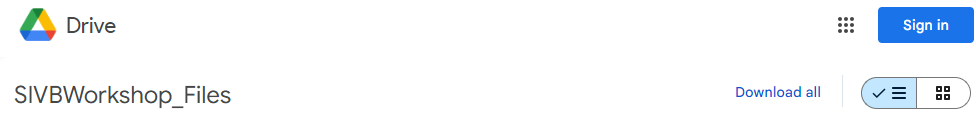
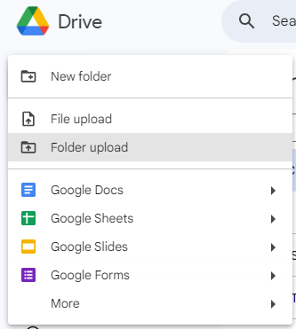
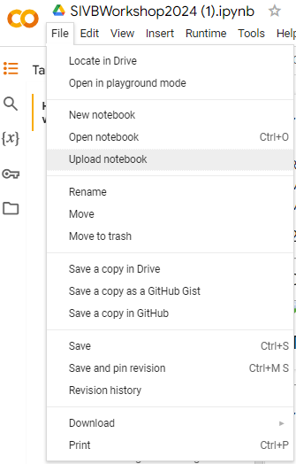
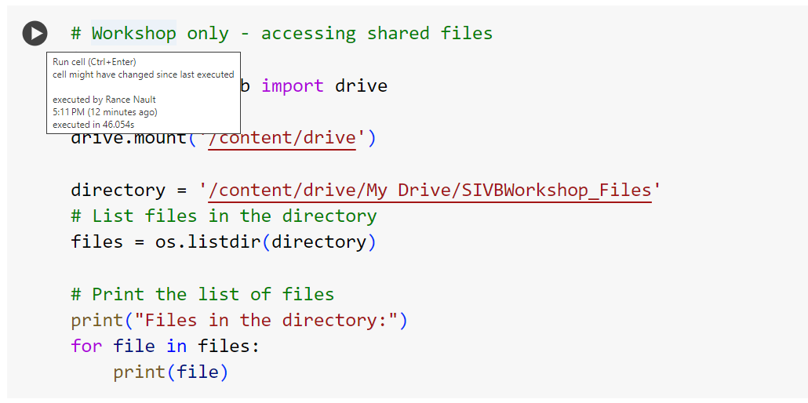

# SIVB Single-cell Hands-on Analysis Walkthrough

------------

## 1. Preparing for the Workshop
Analysis of single-cell data requires a number of software installations and files, which depend on the vendor/platform used. In this example, we will use the [CellRanger](https://www.10xgenomics.com/support/software/cell-ranger/latest/tutorials) pipeline, one of the most commonly used platforms today. **_Before we start_**, please read through this document and ensure that all files are copied to the correct location.

### 1.a. Copy the Contents of the SIVB Shared Google Drive
A link to a shared Google Drive was provided to you via email. These files will be used for the tutorial and may take 1-2 hours to copy due to their size. Ensure you have these files **copied to your own Google Drive**. 

#### Download the folder

#### Extract the zip folder.

#### Log into your Google Drive.

#### Click "My Drive", "New", "Upload Folder".
<b> Be sure to choose the folder called "SIVBWorkshop_Files"</b> inside of the extracted folder.

After doing this, you should have a folder called **SIVBWorkshop_Files**, which should **NOT** be nested within another folder. **The SIVBWorkshop_Files folder should be visible when you click _My Drive_**.

**Note:** You will need at least NN GB of available space.

### 1.b. Download the **Google Colab Workbook**
From this GitHub repository, download the file called **SIVBWorkshop2024.ipynb** as shown below.

Upload this file to **your Google Colab account**. This file is the workshop tutorial.

### 1.c. Test the Google Drive Connection
Open the SIVBWorkshop2024.ipynb file in Google Colab and move to **section 1a**. A gray box will have a `play` button that appears when your mouse is over it.

You will need to give Colab permission to read your Google Drive and access the files. The box should return the following:

#### If all steps completed successfully, you should be able to run the tutorial during the workshop as well as on your own at home.

**Note:** Google Colab is a free cloud service for running code. Because of this, functionality and usage can often be limited. Please keep this in mind when certain parts of the analysis don't complete. Issues/errors with the cloud service are beyond our control, but most of the tutorial can be reproduced on any Linux cloud.
