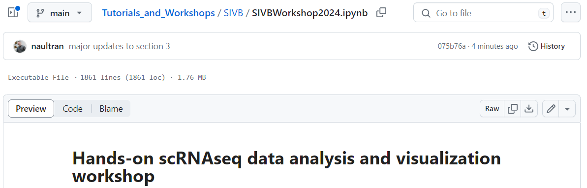
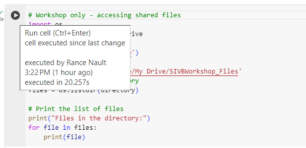
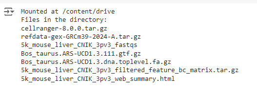

# SIVB Single-cell Hands-on Analysis Walkthrough

------------

## Preparing for the Workshop
Analysis of single-cell data requires a number of software installations and files, which depend on the vendor/platform used. In this example, we will use the [CellRanger](https://www.10xgenomics.com/support/software/cell-ranger/latest/tutorials) pipeline, one of the most commonly used platforms today. **_Before we start_**, please read through this document and ensure that all files are copied to the correct location.

### 1. Copy the Contents of the SIVB Shared Google Drive
A link to a shared Google Drive was provided to you via email. These files will be used for the tutorial and may take 1-2 hours to copy due to their size. Ensure you have these files **copied to your own Google Drive**. 

#### 1.A. Download the folder
<kbd>

</kbd>

#### 1.B. Extract the zip folder.
Using the typical method for your computer/operating system, extract the contents of the downloaded zip folder.

#### 1.C. Log into your Google Drive.
<i>Note:</i> Some instutions may have some limits and what their account can do on Google. It may be necessary to use your own account or create one for this workshop.

#### 1.D. Click "My Drive", "New", "Upload Folder".
<kbd>

</kbd> 

<b> Be sure to choose the folder called "SIVBWorkshop_Files"</b> inside of the extracted folder.

After doing this, you should have a folder called **SIVBWorkshop_Files**, which should **NOT** be nested within another folder. **The SIVBWorkshop_Files folder should be visible when you click _My Drive_**.

**Note:** You will need at least <u>12 GB</u> of available space.

### 2. Download and upload the **Google Colab Workbook**

#### 2.A. Download the notebook
From this GitHub repository, click on and download the file called **SIVBWorkshop2024.ipynb** as shown below.
<kbd>

</kbd>

#### 2.B. Upload the notebook
Upload this file to **your Google Colab account**. This file is the workshop tutorial.

<kbd>

</kbd>

### 3. Test the Google Drive Connection
Open the SIVBWorkshop2024.ipynb file in Google Colab and move to the following <i>code chunk</i>. A gray box will have a `play` button that appears when your mouse is over it.
<kbd>

</kbd>

You will need to give Colab permission to read your Google Drive and access the files. The box should return the following:

<kbd>

</kbd>

#### If all steps completed successfully, you should be able to run the tutorial during the workshop as well as on your own at home.

**Note:** Google Colab is a free cloud service for running code. Because of this, functionality and usage can often be limited. Please keep this in mind when certain parts of the analysis don't complete. Issues/errors with the cloud service are beyond our control, but most of the tutorial can be reproduced on any Linux cloud.
