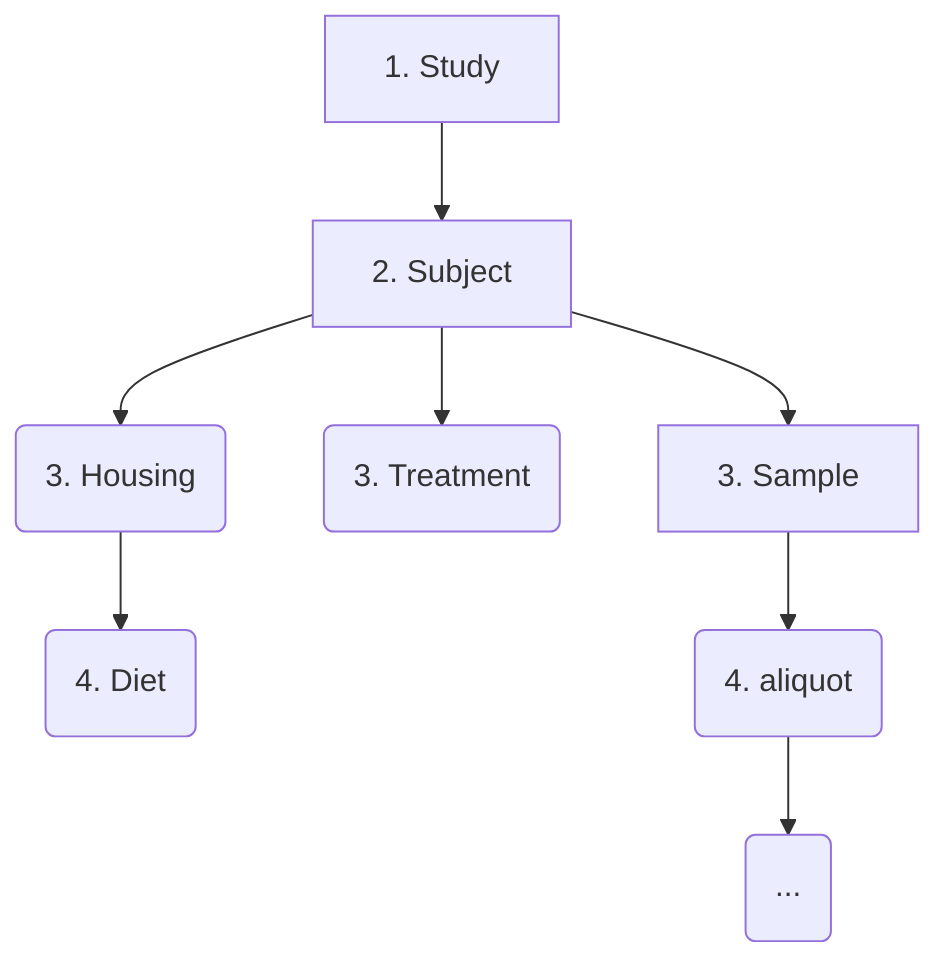

# ToxDataCommons Walkthrough

_Walkthrough for data submission was prepared by Rance Nault and last updated October 19, 2025. Any questions, feedback, or other, can be directly to the Michigan State University Superfund Research Center Data Management and Analysis Core (naultran-at-msu-dot-edu)_

---

## 🪜 Overview: Dataset-First vs. Metadata-First

**ToxDataCommons** can be approached in two main ways:


* **Dataset-first** (Data Lake $\rightarrow$ Data Commons): You manage data after the study is complete and you want to share it. This is the current common approach due to limited resources for *building* data depositions.
* **Metadata-first** (**Preferred**): You plan data management from the start. Metadata is entered as the study is designed and planned. This is more work upfront but means your data is ready to share immediately upon generation.

> This walkthrough assumes the **dataset-first approach** but highlights where steps differ for the metadata-first strategy.

---

## 📁 Organize Your Files

### Recommended Folder Structure

This structure isn't required but helps keep your data organized and simplifies the upload process.

```plaintext
[Program_name]          # (e.g., MSUSRC)
└── [Project name]          # (e.g., PROJECT1)
    └── [Study name]            # (e.g., Experiment_A)
        ├── DataFiles           # where your datasets will go
        └── MetadataFiles       # where your sheetMATE files will be saved
```

* **Program**: An overarching institute, center, or network working on shared goals (e.g., **MSUSRC**). This level provides access to collaborative studies.
* **Project**: A smaller group for focused experiments. Subjects/samples typically stay within a project but may be used across multiple experiments.

> You will be assigned a **Program** and **Project** name after informing the ToxDC team of your submission plans.

<div style="background-color:#ffe5e5; padding:10px; border:1px solid #ffcccc; border-radius:6px; margin-top:8px;">
<details>
  <summary><i><b>Developer notes</b></i></summary>
<b>#TODO:</b> The team will set up a Google form to formalize the request process. Currently we are able to handle the volume on a per-user basis.
</details>
</div>

---
## 📄 What is a Data File?

A **data file** is any measurement output from studies that can be assigned to one or more **subjects** or **samples**.

**Examples:**
* Body weights
* Serum metabolite levels
* Mass spectrometry peak files
* Instrument outputs in open or proprietary formats

---

## 🪙 File Format Considerations

Whenever possible, use **open, non-proprietary formats**. This allows others to work with your data using any open-source or paid software.


> see [The National Archives](https://www.archives.gov/records-mgmt/policy/transfer-guidance-tables.html) for an extensive list of open format.

**Additional resources for common data types (not comprehensive)**:
- Biomedical imaging: [Bio-Formats](https://bio-formats.readthedocs.io/en/stable/supported-formats.html)  
- Mass spectrometry:  
  - [PRIDE file formats](https://www.ebi.ac.uk/pride/markdownpage/pridefileformats)  
  - [Metabolomics Workbench](https://www.metabolomicsworkbench.org/data/DRCCDataDeposit.php)
  - [MASSive](https://massive.ucsd.edu/ProteoSAFe/static/massive.jsp?redirect=auth)
- Flow cytometry:
  - [International Society for Advancement of Cytometry](https://isac-net.org/page/Data-Standards)
- Gene expression data:
  - [GEO](https://www.ncbi.nlm.nih.gov/geo/info/submission.html) 

---

## 📝 Manually Collected Data Format

Manually recorded data is often the **least standardized**. ToxDataCommons accepts, at minimum, a tabular file with the following columns:

| `link.submitter_id` | `value` | `unit` | `unit_ontology` | `comment` |
|---|---|---|---|---|
| The identifier linking to a **subject**, **sample**, or **aliquot** in ToxDataCommons. **REQUIRED**. | The measured value (number only). | The measurement unit (e.g., grams). Must be part of a **Unit Ontology (UO)**. | Ontology ID for the unit (e.g., UO\_0000021). | Any additional detail that does not fit the structure. |

> **Ontologies** can be looked up via the [EMBL Ontology Lookup Service (OLS)](https://www.ebi.ac.uk/ols4/).

**Other commonly included columns:**
* `days_relative_to_start`
* `measurement_ZT`
* `is_terminal`

<div style="background-color:#ffe5e5; padding:10px; border:1px solid #ffcccc; border-radius:6px; margin-top:8px;">
<details>
  <summary><i><b>Developer notes</b></i></summary>
<b>#TODO:</b> Add more robust ontology validation matching [name] $\rightarrow$ [name\_ontology] on the server side of SheetMATE. Must match the rules of the data model.
</details>
</div>

# START HERE

## 🗎 Using SheetMATE

> <b> To begin you must have a unique study identifier (or use one previously created) </b>

1.  **Download** a copy of the **SheetMATE App Script**.

> Contact the ToxDataCommons team for access to the alpha version of SheetMATE.

    <details>
      <summary><strong>⚠️ Note</strong></summary>
      <div style="background-color:#f6fa87; padding:10px; border:1px solid #ffcccc; border-radius:6px; margin-top:8px;">
        SheetMATE is under active development. You may encounter functionality limitations or security warnings. This link is for testing and development only. The ToxDataCommons team welcomes feedback.
      </div>
    </details>
2.  **Run the Application**:
    * **Extensions** $\rightarrow$ **App Script** $\rightarrow$ **Code.gs** $\rightarrow$ **Run**
    > You will be prompted to grant permissions. If you prefer not to grant them (due to the current non-server-connected version), contact the ToxDataCommons team for templates instead.
3.  A new menu option named **“ToxDataCommons”** will appear.

---

## Set up study

This step is also the starting point for the **metadata-first** approach. We assume your program and project are already created.

1.  **Load the Study template**: **ToxDataCommons** $\rightarrow$ **Populate metadata template**
    
2.  **Populate the template**. Additional instructions and rules are provided directly within the template.

---

### 1. Prepare Data File Manifest

Use the SheetMATE app to create a manifest that lists all files you plan to upload. This is necessary for both data-first and metadata-first approaches.

1.  **Set up the template**: **ToxDataCommons** $\rightarrow$ **Create Data File Manifest**
2.  **Populate the list of files**:

| `file_name` | `project` | `type` | `submitter_id` |
|---|---|---|---|
| The exact name of the file to be uploaded as a dataset. | The assigned project name. | Name of the data node this dataset belongs to. | An ID used to represent the file (e.g., file name without the extension). |

**Possible Types (Data Nodes)**
* `weight_measurements` (e.g., body weights, sample/aliquot weights)
* `slide_image` (e.g., biological imaging data)
* `unaligned_read` (e.g., raw fastq files)
* `unaligned_reads_qc` (e.g., FastQC output)
* `aligned_read` (e.g., bigWig, aligned read counts)
* `flow_data` (e.g., FCS format)
* `ms_raw_data` (e.g., mzML, Waters .RAW)

> A list of nodes, descriptions, and formats can be found on the [ToxDataCommons Data Dictionary page.](https://dev.toxdatacommons.com/DD)

---

## 2. Populating node templates

**Metadata upload must follow the order of the data dictionary** to ensure proper linking.

For example, the hierarchy should be followed:



Use the exact same method (**ToxDataCommons** $\rightarrow$ **Populate metadata template**) for the remaining templates. By following this order, **identifiers will be pre-populated**.

---

### 3. Linking Metadata to Dataset

When you reach the step for the specific data file node (e.g., `weight_measurements`), fill out the template as you have for others.

For the file information, use the **GUID** that was assigned when you submitted the **File Manifest** (you do not need to add columns like file name, size, etc.).

